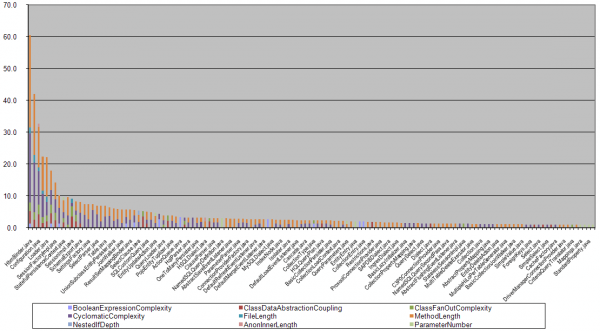

# toxicity

Build plugins, a CLI and libraries for measuring and communicating code quality using toxicity scores and charts. 

In comparison to other projects this one aims to be language independent, file format independent and easy to use.

[Toxicity charts](http://erik.doernenburg.com/2008/11/how-toxic-is-your-code/) are a simple and effective way to communicate code quality (or perhaps lack of it) to other human beings.
A Toxicity chart is a vertical bar chart where each bar represents a file and the height of the bar is proportional to the toxicity score.



The toxicity score is based on code quality metrics and thresholds:

> For example, the method length metric has a threshold of 30. If a class contains a method that is longer it gets points proportional to the length of the method in relation to the threshold, e.g. a method with 45 lines of code would get 1.5 points because its length is 1.5 times the threshold. The score for all elements is added up. So, if a class comprises two methods, one that is 45 lines and another that is 60 lines long, the method length component of the score for the class will be 3.5 points. This means that elements are not just classified as toxic but the score reflects how toxic the element is.

-*[Erik Dörnenburg](http://erik.doernenburg.com/2008/11/how-toxic-is-your-code/)*

For a more thorough introduction to toxicity charts and scores createReader the original article [How toxic is your code?](http://erik.doernenburg.com/2008/11/how-toxic-is-your-code/) by *Erik Dörnenburg* and the follow-up: [Toxicity reloaded](http://erik.doernenburg.com/2013/06/toxicity-reloaded/).

## Generating toxicity reports

The build plugins can be used to easily generate toxicity reports from your projects code.

Alternatively with the CLI you can generate toxicity reports from metrics files generated by other code quality tools such as Checkstyle or ESLint.

Or roll your own tools and plugins using the library and the reader and writer plugins.

**Build plugins**

* [gradle-toxicity](gradle-toxicity/README.md) - `uk.co.josephearl:gradle-toxicity`

**CLI**

* [toxicity-cli](toxicity-cli/README.md) - `uk.co.josephearl.toxicity:toxicity-cli`

**Library**

* [toxicity](toxicity/README.md) - `uk.co.josephearl.toxicity:toxicity`

**Readers and reports**

* [metrics-readers](metrics-readers/README.md):
    * [checkstyle](checkstyle/README.md) - `uk.co.josephearl.toxicity:metrics-reader-checkstyle`
* [thresholds-readers]():
    * [checkstyle](checkstyle/README.md) - `uk.co.josephearl.toxicity:thresholds-reader-checkstyle`
    * [eslint](eslint/README.md) - `uk.co.josephearl.toxicity:thresholds-reader-eslint`
* [toxicities-reporters]():
    * [csv](csv/README.md) - `uk.co.josephearl.toxicity:toxicities-createWriter-csv`
    * [html](csv/README.md) - `uk.co.josephearl.toxicity:toxicities-createWriter-html`

**Standard thresholds**

A set of standard thresholds are provided for use with the metrics output from common tools code quality tools. These also provide configuration files that can be used with the tool to gather metrics correctly.

* [checkstyle](checkstyle/README.md) - `uk.co.josephearl.toxicity:thresholds-checkstyle`
* [eslint](eslint/README.md) - `uk.co.josephearl.toxicity:thresholds-eslint`

## Developing toxicity

To build everything and run all tests, publish the gradle plugin locally and run the gradle plugin on toxicity and toxicity-cli:

```
./gradlew clean publishToMavenLocal build
```

## TODO

**Development**

* README more (sub-readme's)
* CLI support HTML
* Gradle plugin support HTML
* HTML report table
* Builders for imm types?
* Toxicity threshold for plugin (and allowFailures)
* Var args??? (what did I mean by this?)
* Measuring metrics (e.g. w/ Checkstyle - examples of generating)
* Save checkstyle report (gradle plugin)
* Publish
* sbt-toxicity that uses SbtCheckstyle and java toxicity libs
* Add threshold info in writers?
* More stats in CSV? averages, threshold info?
* More packaging formats for CLI(s)? Docker? npm? (or just make JS version?)
* JSON formats for toxicities, readers, writers (easy compatibility with JS version)
* Languages: JS, C#, Scala (can use Scalastyle? or Checkstyle)?  ... Ruby? Python? Go? etc

**Research**

* Toxicity graphs for popular projects in JS, Java, Scala, Ruby etc
* Comparison of toxicity to repos of same language
* Comparison of toxicity to languages
* Comparison of toxicity to other quality measures
* Comparison of toxicity to coverage, development methodologies, team size/experience etc

## Related projects

* [softvis/toxicity-reloaded](https://github.com/softvis/toxicity-reloaded) - HTML toxicity chart
* [katta/toxicity](https://github.com/katta/toxicity) - Java based tool for calculating toxicity from Checkstyle reports
* [AdamNowotny/toxicity-charts](https://github.com/AdamNowotny/toxicity-charts) - Toxicity charts for .NET code
* [halvards/toxicity-dotnet](https://github.com/halvards/toxicity-dotnet) - C# based toxicity score calculator
